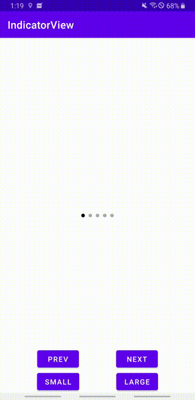

# IndicatorView



## Usage

```xml
<com.github.sasakitomohiro.indicatorview.IndicatorView
            android:id="@+id/indicator"
            android:layout_width="match_parent"
            android:layout_height="wrap_content" />
```

```kt
binding.root.doOnLayout {
    binding.indicator.count = 5
    binding.indicator.selectedIndex = 0
}
```
